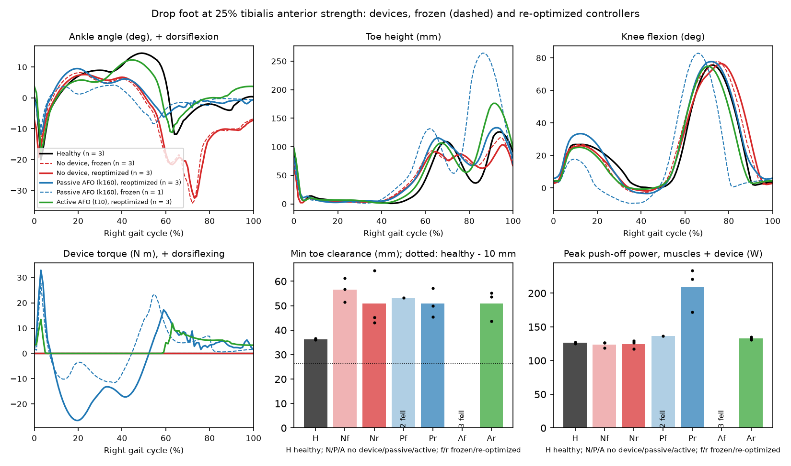

# Drop-Foot Gait and an IMU-Triggered Ankle Exoskeleton in a Neuromuscular Simulation



A reflex-controlled walking model (Geyer and Herr 2010, in SCONE) with a weak right tibialis anterior walks with the steppage gait of drop foot once its controller re-optimizes, and an ankle exoskeleton for it was sized, given a torque controller and triggered only by gait events from a simulated shank gyroscope. A hypothesis committed before the comparison (the active AFO restores toe clearance without costing push-off, the best passive AFO costs more than 15% of push-off) was rejected over three optimization seeds, because the passive AFO's spring returned energy at push-off instead of resisting it. The active AFO left toe clearance unchanged, since the adapted model already over-compensated, but let the model drop most of its steppage and lowered its cost of transport by 5%.

The full specification is [`docs/assignment.md`](docs/assignment.md). It combines tasks from the five courses below into one project. The report is [`report/main.pdf`](report/main.pdf); an animation of the four conditions is [`figures/dropfoot_conditions.gif`](figures/dropfoot_conditions.gif).

## Results

All numbers are mean +/- SD over three CMA-ES seeds; falls are counted, never averaged. Each part's folder has a README with the details.

- **Healthy model** ([`results/healthy`](results/healthy), [`results/normative`](results/normative)). Three seeds converge to the same gait: 1.16 m/s, stride 1.36 s, r = 0.95 to 0.97 against Camargo et al. (2021) hip, knee, ankle moment and vertical force curves; a constant 19 degree hip offset from a forward-tilted pelvis.
- **Drop foot** ([`results/dropfoot`](results/dropfoot)). With the healthy controller the model falls at every strength below 96 to 99%. Re-optimized, it walks at 50, 25 and 10% in every seed, with steppage (+6 to +11 degrees of swing hip flexion), a plantarflexed foot in swing and at contact, toe clearance 9 to 20 mm *above* healthy, and 5 to 11% higher cost of transport.
- **Actuator** ([`results/actuator`](results/actuator)). Requirement 13.6 N m peak. maxon EC 45 flat with N = 75 and k = 1081 N m/rad, 6.76 J per stride; the spring saves only 0.4% against a rigid drive. The SEA controller at 20 Hz gives 28.8 Hz bandwidth and 1.5% RMS tracking error; the simulated device uses an 8 ms delay plus 3.3 ms lag fit.
- **Event detector** ([`results/detector`](results/detector)). On simulated healthy gait every event is found (heel strike +25 +/- 3 ms); on adapted drop foot 99% (+24 +/- 14 ms); on the real shank gyroscopes of 20 Camargo subjects, unchanged, 99.8% of heel strikes and 99% of toe-offs.
- **Device experiment** ([`results/device`](results/device)). Frozen reflexes cannot wear either device (even a 5 N m/rad spring makes them fall). Re-optimized, all conditions walk; the verdict table is below.
- **Robustness** ([`results/robustness`](results/robustness)). Doubled gyroscope noise changes nothing; one active seed falls at any IMU or actuator delay other than the nominal one; no condition, healthy included, survives a 25 N push in all three seeds (the healthy model falls in every seed, the active AFO stays up longest). SPEED_RESULT

| Hypothesis part | Threshold | Value | Result |
|---|---|---|---|
| 1. Active AFO toe clearance >= healthy - 10 mm | 26.3 mm | 50.8 +/- 6.3 mm | holds |
| 2. Active AFO push-off >= 90% of no device | 111.8 W | 132.7 +/- 2.1 W | holds |
| 3. Passive AFO push-off < 85% of no device | 105.5 W | 208.9 +/- 32.4 W | fails: **rejected** |

## What did not work

- **The primary metric.** Toe clearance did not separate the devices: the adapted model already lifted its toe higher than healthy by lifting its hip, and all three re-optimized conditions ended at the same mean clearance. The device's effect showed in the steppage and the cost of transport instead. The one-sided threshold in the decision rule also does not match the "within 10 mm" wording of the hypothesis (read two-sided, part 1 would be inconclusive).
- **The passive AFO's expected cost.** The hypothesis assumed a passive AFO resists push-off. A 160 N m/rad spring at neutral 0 stores energy in stance dorsiflexion and returns it in early push-off; total push-off power rose by 70%.
- **Frozen controllers.** The tuning was meant to pick each device's setting on the frozen drop-foot controllers, but no setting let all seeds walk, and the rule had to be completed (in a separate commit, before the comparison). The optimized gaits have no reserve at all.
- **Sizing on the model's trajectory.** On the adapted model's own ankle motion, with its 2100 rad/s^2 foot slap, no motor design was feasible; the actuator was sized on the normative trajectory instead.
- **Convergence in 150 generations.** The 25% and 10% drop-foot runs needed one or two continuations to converge; at 10%, two seeds were still falling after 150 generations. Three of the nine device re-optimizations had not converged at the committed budget; continued to convergence, they leave every part of the verdict unchanged ([`converged_check.md`](results/device/converged_check.md)). One continuation (passive seed 1) ended worse than its start, because CMA-ES restarts with its full step size, and was first curated anyway; the evaluation cache was keyed on the name only and returned the old simulation for the corrected file. Both were fixed in their own commits.
- **Engineering detours**, each fixed in its own commit: SCONE copies only the script file into the optimization folder, so the Lua modules had to be bundled into one file; the SEA model feedforward opened a 15 dB notch at the locked resonance until the derivative term was compensated; linear interpolation of gait curves made current chatter; the first frozen active sweep used an actuator fit from unconverged results; the first push score was 0 N for every condition.

## Reproduce

Python 3.12 and the `scone-headless` Docker image of the companion repository ([`results/ENVIRONMENT.md`](results/ENVIRONMENT.md)):

```
uv venv --python 3.12 .venv && source .venv/bin/activate && uv pip install -e ".[dev]" && pytest
python scripts/fetch_data.py scone          # SCONE tutorial files at a pinned commit
python scripts/fetch_camargo.py             # Camargo et al. (2021), see data/README.md
python analysis/make_figures.py             # every table and figure from the committed .par files
cd report && latexmk -pdf main.tex
```

`make_figures.py` re-evaluates the committed `.par` files (no optimization). With `SCONE_HOST=<ssh host>` the SCONE evaluations run on another machine that has the image and a copy of the repository (`scripts/remote.sh <host> push`). Re-running an optimization: `python scripts/run_scone.py optimize <scenario> --seed <s> --generations 150`, then `python analysis/curate_runs.py <condition>`. The steps that need the Camargo data are skipped without it.

**Related repositories.** [scone-pathological-gait](https://github.com/mzlumi/scone-pathological-gait) is the companion repository: the EPFL BIOENG-404 SCONE assignment (healthy gait, heel walking from plantarflexor weakness, toe walking from hyperreflexia, crouch gait). This project reuses its headless SCONE runner and gait analysis code instead of copying them. This repository covers a different impairment (dorsiflexor weakness) and adds what that one does not have: a device, its actuator, an IMU event detector and a controlled experiment. The event detector pairs with [imu-locomotion-gait-phase](https://github.com/mzlumi/imu-locomotion-gait-phase) (gait phase from real wearable IMUs), and the sensor error model with [imu-opensim-validation](https://github.com/mzlumi/imu-opensim-validation) (IMU kinematics against optical motion capture).

## Adapted from

### CMU 16-868, Carnegie Mellon University

- **Course.** 16-868, taught by Prof. Hartmut Geyer (Legged Systems Group, Robotics Institute). The current course page titles it "Legged Systems" (fall semester, 12 units, graduate elective). The past student report below calls it "Biomechanics & Motor Control".
- **What the course covers.** Modeling, analysis and control of legged locomotion, from simple gait models (compass gait, linear inverted pendulum, spring-mass) through segmented legs to the human system (Hill-type muscles, reflexes, neuromuscular gait models) and to exoskeletons and prostheses (impedance, phase-based and virtual neuromuscular control). Coding is in MATLAB Simulink with starter code. Four to five assignments (67%) and a final project on "a legged mobility problem of their own choosing" (33%).
- **The original task.** A past final project (Dermksian, Mitchell, Murthy and Rasmussen; the report does not give the term) took the 2D Geyer and Herr reflex model in Simulink, reduced the maximum isometric force of tibialis anterior in one leg to 33% of healthy (265 N of 800 N), and re-optimized 32 controller parameters (16 per leg: reflex gains, offsets and position gains) with CMA-ES on a cost of effort, speed and distance. The simulated stride (1.01 m, 1.64 s, 0.65 m/s) fell within one standard deviation of published drop-foot patient data. The 2D model raised its knee more than patients do, which the authors attribute to the missing out-of-plane compensation.
- **Links.** Course page: <https://sites.google.com/andrew.cmu.edu/ri-lsg/teaching-16-868>. Project page: <https://www.michaeldermksian.com/biomechanics-walker/>. Report: <https://www.michaeldermksian.com/biomechanics-report.pdf>.

### Georgia Tech ME 6409 Biomechatronics of Wearable Robotic Devices

- **Course.** ME 6409, Spring 2026 syllabus, taught by Dr. Aaron Young and Dr. Greg Sawicki.
- **What the course covers.** Human-machine interaction for wearable robots that restore or augment movement, run as two parallel threads: the "human machine" (locomotion neuromechanics and energetics, muscle-tendon actuation, biological sensing and control) and the engineered device (actuators, sensors, low, mid and high-level control, evaluation). Weekly MATLAB/Simulink sessions build a Hill-type muscle-tendon model, with series and parallel elasticity, which "will form the backbone for students to add a wearable robotic device to their model". One of the five case studies is on ankle weakness.
- **The original task.** The final project (40%) is "a computer simulation of your own design set up to address a hypothesis-driven question relevant to wearable robotics", with a mid-semester proposal that lists the independent and dependent variables and the hypotheses, and a report of at most 6 pages in journal format.
- **Links.** Syllabus: <https://syllabus.gatech.edu/sites/default/files/2026-04/Wearable%20Robotics%20Fall%202026%20USG%20Syllabus.pdf>. A separate portfolio project in the same final-project format is [me6409-joint-moment-estimation](https://github.com/mzlumi/me6409-joint-moment-estimation).

### UCLA MAE 263E Bionic Systems Engineering

- **Course.** MAE 263E, taught by Prof. Tyler R. Clites (Anatomical Engineering Group). The syllabus prints no term; its calendar fits Winter 2022.
- **What the course covers.** Design principles for bionic systems, both wearable robots and implantable devices: neural control of movement, neuromusculoskeletal modeling, actuator design, sensor integration, robotic control, neural interfacing, amputation surgery and orthopaedic implants. MATLAB and OpenSim, six problem sets, a midterm and a final project.
- **The original task.** "Simulate a movement pathology and design a wearable robotic system to improve human function."
- **Links.** Syllabus: <https://fec.seas.ucla.edu/wp-content/uploads/fec/Syllabus_MAE263E.pdf>.

### Utah ME EN 7960 Wearable Robotics

- **Course.** ME EN 7960-001, taught by Dr. Tommaso Lenzi. The syllabus prints no year; its calendar fits Fall 2022.
- **What the course covers.** Design, modeling and control of powered exoskeletons and robotic prostheses: morphology, actuation (DC motors, series and parallel elastic, variable stiffness and variable transmission actuators), biosignals, and low, mid and high-level control (finite-state machines, phase-based control), with a project on an open-source robotic leg prosthesis from the Bionic Engineering Lab.
- **The original task.** Homework 1 dimensions an advanced actuator from human biomechanics ("Dimension a series elastic actuator to minimize the energy consumption of a powered ankle prosthesis"). Homework 3 develops and simulates a low-level closed-loop controller for that actuator. The low-level control readings are Vallery et al. (IROS 2007) and Paine et al. (TMECH 2014).
- **Links.** Syllabus: <https://rmcoeh.com/images/pdfs-doc/courses-syllabi/MEEN%207960%20Syllabus.pdf>.

### Stanford BIOE/ME 485 Modeling and Simulation of Human Movement

- **Course.** BIOE/ME 485, taught by Prof. Scott Delp, Spring 2023 offering. The course resources are on the OpenSim documentation site.
- **What the course covers.** OpenSim tutorials (musculoskeletal modeling, tendon transfer, scaling, inverse kinematics and dynamics), four labs and a student research project.
- **The original task.** Lab 1, "Simulation-Based Design to Prevent Ankle Injuries": in a drop landing on a sloped surface, compare no AFO, a soft and a stiff passive AFO, then design an active orthotic by optimizing the timing and level of a torque motor at the ankle, and test muscle co-activation.
- **Links.** Course page: <https://opensimconfluence.atlassian.net/wiki/spaces/OpenSim/pages/53084234/BIOE-ME+485+Spring+2023>. Lab 1: <https://opensimconfluence.atlassian.net/wiki/spaces/OpenSim/pages/53088618>.

### Notre Dame AME 60553 Wearable Robotics

- **Course.** AME 60553, taught by Prof. Edgar Bolivar-Nieto (Wearable Robotics Laboratory), first offered in 2023.
- **What the course covers.** Compliant actuation for exoskeletons, exosuits and prostheses, dynamic models of the body and the robot, hierarchical control through state variables, finite-state machines and impedance control, optimization for design and real-time control, and evaluation of health outcomes. The lecture notes are linked publicly from the course page.
- **What this project takes from it.** Motor selection (L9), the role of series and parallel elasticity (L12), and impedance, finite-state and phase-variable control of powered orthoses (L21).
- **Links.** Course page and notes: <https://werolab.nd.edu/teaching/wr/>.

### Also related: EPFL BIOENG-404 Analysis and Modelling of Locomotion

The 2021 SCONE assignment of this course (Bruel, Stanev, Di Russo and Ijspeert) optimizes the same `Human0914` model with a Geyer and Herr reflex controller, then simulates heel walking from plantarflexor weakness, toe walking from hyperreflexia, and a self-chosen change that should produce heel or toe walking. That assignment is done in the companion repository [scone-pathological-gait](https://github.com/mzlumi/scone-pathological-gait), which also keeps its handout. It is not repeated here.

All retrieved course documents are listed in [`docs/SOURCES.md`](docs/SOURCES.md).

## The problem

**Model.** SCONE's planar `Human0914` model: 9 degrees of freedom, 7 muscles per leg (hamstrings, gluteus maximus, iliopsoas, vasti, gastrocnemius, soleus, tibialis anterior), foot-ground contact, driven by the Geyer and Herr (2010) reflex controller and optimized with CMA-ES for walking at about 1.2 m/s with low effort.

**Impairment.** Unilateral right-side drop foot: the maximum isometric force of `tib_ant_r` is scaled to 50%, 25% and 10% of healthy. Each level is simulated twice: with the healthy controller unchanged (the immediate effect) and after re-optimizing an asymmetric controller (the model's version of patient compensation). Drop foot is quantified with clinical metrics on the affected side: minimum toe clearance in swing, ankle angle at initial contact, peak swing dorsiflexion, a foot-slap index (peak plantarflexion velocity just after heel strike), steppage (extra hip and knee flexion in swing), left-right asymmetry and cost of transport.

**Device.** A unilateral ankle exoskeleton built from a brushless DC motor, a gearbox of ratio N and a series spring of stiffness k:

1. **Torque requirement.** The torque that the missing tibialis anterior strength would have produced over the gait cycle, plus a 20% margin.
2. **Actuator sizing.** A motor model (torque constant, resistance, reflected inertia) and a sweep over N and k for one real motor, giving electrical energy per stride with the speed, current and voltage limits masked out.
3. **Torque control.** A PID plus feedforward controller on spring-deflection torque, its small-signal bandwidth and its large-signal tracking under saturation, reduced to a first-order-plus-delay model that the simulated device must obey.
4. **Gait events from a shank IMU.** The exoskeleton does not see the simulator's contact forces. It sees one gyroscope on the right shank, sampled at 100 Hz with white noise, a constant bias and a 10 to 20 ms delay. A causal detector finds heel strike and toe-off from the shank angular velocity and estimates gait phase from the running stride time.
5. **Controllers.** A passive AFO (a rotational spring, stiffness swept) and a phase-based active AFO (viscous braking in early stance, zero torque in mid and late stance, PD toward dorsiflexion in swing), both applied as equal and opposite moments on the shank and foot.

**Experiment.** Four conditions (healthy; drop foot with no device; with the passive AFO; with the active AFO). Each device condition is run with the reflex parameters frozen (the first day with the device) and re-optimized with the device on (adaptation), with 3 seeds each. The hypothesis and primary metric are written in this README and committed before the comparison is run. Robustness is tested at a second walking speed, with doubled IMU noise and delay, and with a push or trip.

Example hypothesis from the assignment: at 25% tibialis anterior strength, the active AFO restores minimum toe clearance to within 10 mm of healthy without reducing peak ankle push-off power, while the best passive AFO reduces push-off power by more than 15%.

## Hypothesis

Written and committed before any comparison between devices was run, and before the adapted drop-foot gaits were looked at. Any later change goes in a new commit that says why.

**Hypothesis.** At 25% tibialis anterior strength, after the reflex controller has re-optimized with the device on, the phase-based active AFO brings minimum toe clearance in mid swing to within 10 mm of healthy without lowering peak ankle push-off power by more than 10% compared with drop foot without a device, while the best passive AFO lowers peak push-off power by more than 15%.

**Primary metric.** Minimum toe clearance of the right (affected) foot in mid swing, in mm, as defined in `dropfoot.metrics` (height of the `toes_r` origin over the middle half of swing). Per run it is the mean over all strides after the two start-up strides; per condition it is the mean and SD over the 3 seeds. The healthy reference is the mean of the three healthy seeds (`results/healthy/summary.csv`).

**Secondary metric used in the hypothesis.** Peak ankle push-off power: the peak positive power at the right ankle in stance, muscles plus device (`ankle_angle_r.power` plus the device's τ·θ̇), so that a device that resists push-off counts against itself.

**Decision rule.** Three parts, all judged on the means over seeds:

1. the active AFO's toe clearance is at least the healthy mean minus 10 mm;
2. the active AFO's push-off power is at least 90% of the no-device value;
3. the best passive AFO's push-off power is below 85% of the no-device value.

The hypothesis is supported if all three hold, and rejected if any fails by more than one seed SD. A part that misses its threshold by less than the seed SD is reported as inconclusive. A condition with a fall in any seed counts as failing parts 1 and 2 for that device; falls are reported, never dropped.

**How the devices are set up, decided now.** Both devices get the same treatment. The passive AFO's stiffness (neutral angle 0, k from 10 to 160 N m/rad, a factor of 2 apart) and the active AFO's swing target (0, 5 and 10 degrees of dorsiflexion, other gains set by the design calculation in the controller's commit) are each chosen on the frozen drop-foot controllers by one rule: among the settings with which all three seeds walk 10 s, take the one whose toe clearance is closest to healthy, and the lower setting on a tie. The chosen setting is then re-optimized with 3 seeds.

**If 25% does not work.** If fewer than three adapted seeds walk at 25% strength, the experiment moves to the weakest tested level (50%) at which all three do, and the README says so.

**Addendum to the tuning rule (added in a later commit, before the comparison was run).** The rule above does not say what to do when no setting lets all three seeds walk with the frozen controller. A trial of the pipeline on intermediate, unconverged drop-foot results showed that this can happen (most frozen settings fell). The rule is therefore completed, for both devices alike: among the settings with the most seeds walking, the toe clearance closest to healthy decides; if no seed walks with any setting, the longest mean time before the fall decides; then the lower setting. Nothing else changes, and the comparison itself was not run before this was committed.

## Data

[`data/README.md`](data/README.md) describes every input and how to get it. In short:

- **SCONE** (Apache-2.0 core, GPL-3.0 GUI) and its tutorial scenarios and `Human0914` model. `python scripts/fetch_data.py scone` downloads the tutorial files from scone-core at a pinned commit; the application is installed by hand from SimTK.
- **Camargo et al. (2021)** open dataset (22 adults, treadmill and level-ground walking with IMUs on the trunk, thigh, shank and foot, OpenSim kinematics and kinetics; CC BY 4.0, about 1 GB per subject): normative curves for the healthy model and real shank gyroscope signals for testing the event detector. Downloaded by hand in a browser.
- **One motor datasheet**, chosen during actuator sizing.

Nothing is downloaded into git; `data/raw/` is ignored. Optimized `.par` files are committed so every result can be re-run without re-optimizing.

## Going beyond the coursework

- **A realistic sensor in the loop.** No course project triggered its device from a simulated wearable sensor. Here the detector sees a sampled, noisy, biased and delayed gyroscope, and its timing errors are measured against contact-force ground truth on both healthy and drop-foot gait, because the shank pattern changes when the foot drops.
- **Delay sensitivity.** The benefit of the active AFO is measured as a function of detector and actuator delay, giving a curve of how much latency the controller tolerates.
- **Sim-to-real check of the detector.** The same detector, without retuning, is run on real shank gyroscope data from the Camargo et al. dataset and scored against force-plate events.
- **Spread, not single runs.** CMA-ES is random. Every condition is reported as mean and spread over seeds, falls are counted as results, and the adaptation question (frozen versus re-optimized reflexes) is part of the design.
- **Hardware limits in the loop.** The device torque passes through a fitted model of the sized actuator, so the simulated device cannot apply torque instantly or beyond its limits.

## Validation

- **Healthy model.** Stride-averaged hip, knee and ankle angles, ankle moment and vertical ground reaction force against normative data at a matching speed, with RMSE and Pearson r per curve.
- **Drop-foot model.** Compared with the CMU result (a walking gait at 33% tibialis anterior strength) and with the clinical picture of drop foot: does steppage appear, and does foot slap?
- **Device torque bookkeeping.** SCONE external moments persist until removed, so a constant-torque test checks that the device applies exactly the commanded moment pair and nothing accumulates.
- **Event detector.** Heel-strike and toe-off timing error (mean and SD, in ms) and missed and false detection rates over at least 50 strides, on simulated healthy and drop-foot gait and on real data.
- **Actuator and controller.** Unit tests of the motor model (energy balance, the rigid limit as k grows) and of the torque controller (closed-loop gain, bandwidth from the Bode plot), and a check that the fitted low-order model reproduces the full model's step response.
- **Reproducibility.** Each figure is regenerated by one command from committed results.

## Repository layout

| Path | Content |
|---|---|
| `src/dropfoot/` | Python package: stride segmentation, gait metrics, normative curves, sensor and detector twins, actuator and torque-control models |
| `tests/` | pytest suite; simulation-dependent tests use small committed `.sto` fixtures |
| `scenarios/` | SCONE scenario files, one per condition |
| `scenarios/lua/` | Lua `ScriptController` and `ScriptMeasure` code (gyroscope model, event detector, devices) |
| `analysis/` | Python scripts that turn simulation results into tables and figures |
| `actuator/` | The motor datasheet record ([`MOTOR.md`](actuator/MOTOR.md)); the sizing and control scripts are `analysis/part_c.py` and `analysis/part_e.py` |
| `results/` | Optimized `.par` files, small `.sto` exports, result tables and [`ENVIRONMENT.md`](results/ENVIRONMENT.md) |
| `figures/` | Generated figures |
| `report/` | The written report |
| `scripts/` | Command line tools (data download, SCONE runner) |
| `data/` | [`README.md`](data/README.md) on every input; downloads go to `data/raw/` (git-ignored) |
| `docs/` | The specification, the source index and the private course documents |

Python setup: `uv venv --python 3.12 .venv && source .venv/bin/activate && uv pip install -e ".[dev]" && pytest`. The `scone-gait` dependency comes from the private companion repository, so git needs read access to it (in CI, the `SCONE_GAIT_TOKEN` secret).

## Status

- [x] Package scaffolding, tests and CI; SCONE runner reused from the companion repository
- [x] Stride segmentation and clinical gait metrics, with tests on synthetic signals
- [x] Normative curves from the Camargo et al. dataset
- [x] Part A: healthy baseline over 3 seeds, compared with normative data
- [x] Part B: drop-foot model at 50%, 25% and 10% strength, immediate and adapted, with metrics
- [x] Part C: torque requirement, motor model and (N, k) actuator sweep
- [x] Part D: simulated shank gyroscope and causal event detector, validated on simulated gait
- [x] Event detector tested on real shank IMU data (sim-to-real)
- [x] Part E: SEA torque controller, bandwidth, saturation and fitted actuator model
- [x] Device moment bookkeeping test and passive AFO stiffness sweep
- [x] Hypothesis and primary metric committed before the experiment
- [x] Phase-based active AFO controller
- [x] Part F: experiment over all conditions, both adaptation modes and 3 seeds
- [x] Robustness tests and the delay-sensitivity curve
- [x] Figures from one command, an animation of the drop-foot conditions, report
- [x] Final README with results and a "what did not work" section
- [ ] Before making the repository public: delete `docs/source/` in its own commit

## Credit

The course material in `docs/source/` belongs to the universities and instructors named above: Carnegie Mellon University (Hartmut Geyer), Georgia Tech (Aaron Young and Greg Sawicki), UCLA (Tyler Clites), the University of Utah (Tommaso Lenzi), Stanford University (Scott Delp and the OpenSim team) and the University of Notre Dame (Edgar Bolivar-Nieto). The CMU project report is by Michael Dermksian, Alanna Mitchell, Vybhav Murthy and Eric Rasmussen. These files are kept here for private reference only and must be removed (`docs/source/`) before this repository is made public. The EPFL SCONE handout is by Alice Bruel, Dimitar Stanev, Andrea Di Russo and Auke Ijspeert and is kept only in the companion repository.

SCONE and its tutorial models are by Thomas Geijtenbeek (Apache-2.0 and GPL-3.0). The Camargo et al. dataset is by Jonathan Camargo, Aditya Ramanathan, Will Flanagan and Aaron Young (CC BY 4.0).

This is an independent project, not coursework: Parmida Mazloomi is not enrolled in any of these courses and nothing here was submitted for a grade. The project specification in `docs/assignment.md` adapts the course tasks. The code is written for this project; no code from past students' solutions is used. The plan, the specification and parts of the code and documentation are prepared with the help of an AI assistant and reviewed by Parmida.
