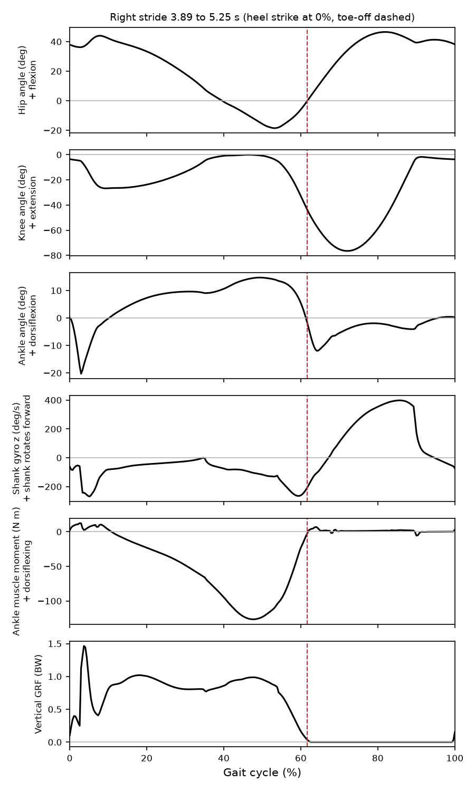

# Sign conventions and units

Decided once, here, and repeated at the top of every script and Lua file that depends on them. They were checked by plotting one healthy right stride (below): the tutorial solution `ResultGait10.par` evaluated in `scenarios/healthy.scone`, exported to `results/sign_check/tutorial_stride.sto` and plotted with `python analysis/plot_stride.py results/sign_check/tutorial_stride.sto figures/sign_check_stride.png`.

## Frames

- SCONE's ground frame: x forward (walking direction), y up, z = x × y, pointing to the walker's right. The model is planar, so all rotations are about z.
- Positive rotation about z is counterclockwise when the walker is seen from the right: it turns +x toward +y.

## Joint angles (SCONE `Human0914`, radians in `.sto`, degrees in figures and tables)

| Signal | Positive direction | Check in the healthy stride |
|---|---|---|
| `ankle_angle_r` | **Dorsiflexion** (plantarflexion negative) | Peaks at about +15 deg in late stance, when the shank rolls over the foot; about -12 deg just after toe-off |
| `knee_angle_r` | Extension; 0 is a straight knee, so the knee is normally negative (flexion) | About -76 deg peak flexion in swing |
| `hip_flexion_r` | Flexion | About +45 deg in late swing, about -18 deg extension before toe-off |

Tables and figures report **knee flexion as a positive number** (the negative of `knee_angle_r`), as clinical gait reports do. Everything else keeps the sign above.

## Moments and powers

| Signal | Positive direction |
|---|---|
| `ankle_angle_r.moment` (sum of muscle moments about the ankle) | Dorsiflexing. The plantarflexor push-off moment is negative (about -125 N m in the healthy stride) |
| `tib_ant_r.ankle_angle_r.moment` | Dorsiflexing (always at least 0, because tibialis anterior only dorsiflexes) |
| `ankle_angle_r.power` | Moment times angular velocity; positive is power generated by the muscles (push-off), negative is power absorbed |
| Device torque `tau_exo` | **Dorsiflexing**, the same sign as `ankle_angle_r`. It is applied as `+tau_exo` about z on `talus_r` and `-tau_exo` on `tibia_r` (see below) |

**Device moment pair.** A dorsiflexing ankle torque rotates the foot counterclockwise relative to the shank when seen from the right (the toes lift, +z rotation of the foot), so it is `+tau_exo` on the foot side (`talus_r`) and `-tau_exo` on the shank (`tibia_r`). The pair sums to zero, so the device cannot push the whole body. This is checked by the constant-torque test scenario.

## Shank gyroscope

| Signal | Positive direction |
|---|---|
| `tibia_r.ang_vel_z` (true) and the simulated gyroscope | +z: the shank rotates forward, distal end moving forward relative to the knee |

Pattern over one healthy stride, which the event detector relies on:

1. a negative minimum shortly before toe-off (about -250 deg/s at 58 to 60% of the cycle), while the knee flexes and the shank rotates backward in push-off;
2. a zero crossing just after toe-off, then a large **positive** peak in mid to late swing (about +400 deg/s) as the shank swings forward;
3. a sharp drop when the knee reaches full extension at the end of swing (about 90% of the cycle), then a zero crossing and a **negative** minimum just after heel strike (about -260 deg/s within 5% of the cycle).

A real shank IMU mounted on the lateral side of the right shank with its z axis pointing laterally reads the same sign. In the Camargo et al. data the sign and the clock offset of `shank_Gyro_Y` differ between subjects; `dropfoot.camargo.align_gyro` calibrates both against motion capture (see `data/README.md`).

The simulated gyroscope (`scenarios/lua/gyro.lua`, twin `dropfoot.sensor`) is in deg/s. Its channels in the `.sto` output are `imu.true`, `imu.measured` (held output), `imu.output_k` (index of the sample in the output), `imu.sample_true` and `imu.sample_k`.

**Logging lag of script channels.** SCONE writes the output frame at time t (t > 0) before the controllers' update at t, so every value a script logs with `store_data` is the one from the previous control step (1 ms earlier). Model channels such as `tibia_r.ang_vel_z` are at time t. Analyses that compare script events with contact events subtract this step.

## Events and gait cycle

- **Heel strike (initial contact):** the vertical ground reaction force of the right foot (`leg1_r.grf_norm_y`) rises through 5% of body weight. **Toe-off:** it falls through 5% of body weight. Crossing times are linearly interpolated between samples.
- **Gait cycle:** from one right heel strike to the next, 0 to 100%.

## Units

SI in all files (m, s, rad, N, N m, W). Degrees and millimetres only in figures and tables, and every column header states its unit.

## A note on the healthy model

The healthy stride above already plantarflexes quickly after heel strike (to about -20 deg within 3% of the cycle, with a shank velocity minimum near -260 deg/s). The planar reflex model lands with a nearly neutral ankle and then lets the foot drop under load. This matters for the foot-slap index in Part B: it has to be compared with the model's own healthy value, not with zero.
